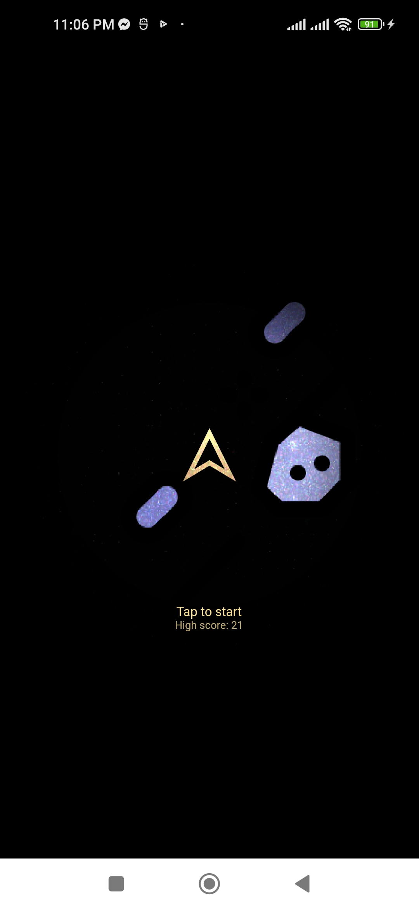

# Smash Asteroid Flutter Game built on top of Flame Engine

Project for the completion of the course of Computer Graphics | BEI(II/II) | IOE, Pulchowk Campus


Score and game state is managed by the [Bloc library](https://bloclibrary.dev).


## Running:

This project contains 3 flavors:

- development
- staging
- production

To run the desired flavor either use the launch configuration in VSCode/Android Studio or use the following commands:

```sh
# Development
$ flutter run --flavor development --target lib/main_development.dart

# Staging
$ flutter run --flavor staging --target lib/main_staging.dart

# Production
$ flutter run --flavor production --target lib/main_production.dart
```

